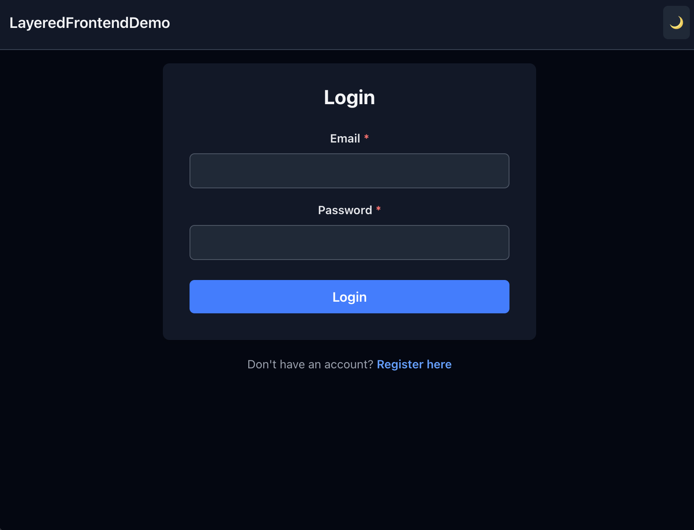

# LayeredFrontendDemo

A full-stack web application with a React frontend and Rails backend.

The client application demonstrates a **layered frontend architecture** where the client code is split into three distinct libraries that are integrated together in the main app:
- **Presentation Layer** (`@obm/ui-components`) - Reusable React components with Tailwind CSS
- **Business Logic Layer** (`@obm/domain`) - Redux state management, thunks, and selectors
- **Data Access Layer** (`@obm/api-client`) - HTTP client for communicating with the Rails backend

This separation creates clear boundaries between concerns and makes each layer independently testable and reusable, while the client app brings them all together.

## Demo Application



The demo includes user authentication (login/register) with dark mode support, showcasing how the layered architecture works together in a real application.

## Project Structure

```
apps/
  client/          # React web app (Vite + React 19 + Redux)
  server/          # Rails 8 API (PostgreSQL + Sidekiq)

libs/
  ui-components/   # React component library (TailwindCSS + Storybook)
  domain/          # Business logic and Redux store
  api-client/      # API client for backend
```

## Setup

### Prerequisites
- Node.js (v20.x)
- Ruby (3.x)
- Docker & Docker Compose
- Bundler
- npm

### Backend Setup

1. Start the database and Redis using Docker:
```bash
cd apps/server
docker compose up -d
```

2. Set up environment variables:
```bash
cp .example.env .env
```

3. Install dependencies and set up the database:
```bash
bundle install
bundle exec rails db:create db:migrate
```

4. Start the Rails server:
```bash
bundle exec rails s
```

### Frontend Setup

1. From the project root, install all dependencies for the monorepo:
```bash
npm install           # Install Nx
npm run install:all   # Install all packages and build libraries
```

2. Start the development server:
```bash
cd apps/client
npm run dev
```

The application should now be running:
- Frontend: http://localhost:5173 (or the port shown in terminal)
- Backend API: http://localhost:3000

## Development

### Building

```bash
# Build all libraries (from project root)
npm run build:libs

# Build everything (libraries + apps)
npm run build
```

### Component Development

To work on UI components in isolation:
```bash
cd libs/ui-components
npm run dev  # Opens Storybook
```

## Testing

```bash
# Frontend
cd apps/client && npm test

# Backend
cd apps/server && bundle exec rspec
```
